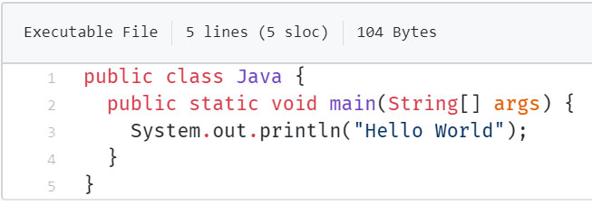
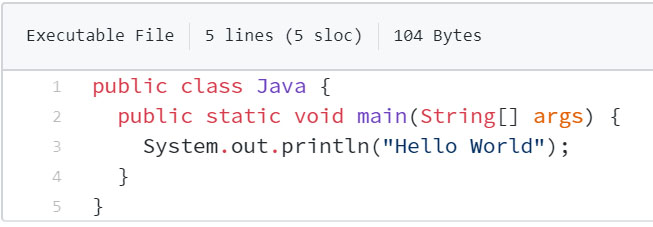

# Introduction

Font and tab customization from [GitHub-Dark](https://github.com/StylishThemes/GitHub-Dark) without any theme.

# Preview

### Fira Code

### Operator Mono

### Souce Code Pro

# Installation

Install [Stylus](https://add0n.com/stylus.html) for Firefox, or Chrome. Then, install the [usercss](https://raw.githubusercontent.com/chandr3sh/Github-Font/master/github-font.user.css) which supports automatic updates and customization.
